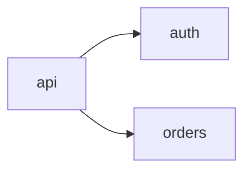

`braid/map.md` is a shortcut: a newcomer (or a fresh agent) reads it instead of
re-exploring the repo. Facts verified in code only, no aspirations. **≤150
lines.**

## Build or patch?

- No `braid/map.md`, or `rebuild` asked → **build**.
- Map exists → read its header SHA and run `git diff --name-only <sha>..HEAD`.
  Nothing relevant changed → say so, stop. Changes touch a few modules →
  **patch** only those rows, flows, and the diagram. More than about a third of
  the modules changed, or the SHA is gone → **build**.

## Build

Sample, don't read everything:

1. README, manifests (`package.json`, `pyproject.toml`, `go.mod`, `Cargo.toml`, `*.csproj`, ...), CI config.
2. `git ls-files` for the tree; skip vendored and generated paths.
3. Churn, to find what matters: `git log --since=6.months --name-only --format= | sort | uniq -c | sort -rn | head -30`.
4. Open entry points and the most-touched modules; trace one or two real flows end to end.

## Format

~~~markdown
<!-- braid:map sha=<git rev-parse --short HEAD> date=<YYYY-MM-DD> -->
# Repo map

<one or two lines: what this is, for whom>

## Run and verify
<exact commands: install, run, test, lint>

## Entry points
- `<path>`: <what starts here>

## Modules
| Path | Job | Key files |
|---|---|---|
| `src/auth/` | sessions and tokens | `jwt.ts`, `middleware.ts` |

## Key flows
### <flow name>
1. `<file>:<function>` <step>
2. ...

## Conventions
- <how this codebase does X; the one way to follow>

## Gotchas
- <looks wrong but is intentional / easy to break / surprising>

## Diagram

~~~

Rules:

- One line per module job. Name where things live; don't explain how they work.
- The diagram shows module dependencies, ≤15 nodes. Skip it for single-module repos.
- Behavior belongs in `braid/specs/`, terms in `braid/GLOSSARY.md`, decisions in `braid/adr/`. Link them, never copy.
- Always rewrite the header with the current short SHA and date. The session hook uses it to report how stale the map is.
